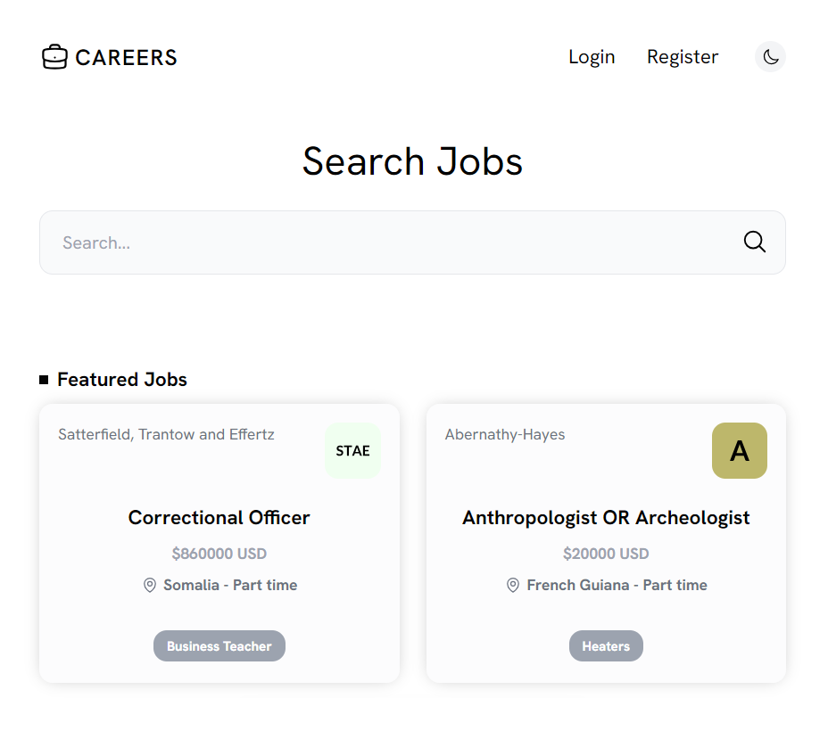

# Careers app

Careers is a job listing app based on Laravel. This project is a continuation of the Laracasts "Final Project" of the "30 Days to Learn Laravel" course

I added the following features

- Better dummy company logo seeding
- Better job tag seeding to avoid duplication errors
- Switch between dark and light mode
- Mobile sliding menu responsiveness
- Search validation
- Admin user capabilities for all jobs and accounts
- Companies page specific for admin
- Profile page with editing feature
- Jobs page for company specific listings
- Edit/Delete capabilities for company owned listings
- Top right dot mark on featured listings
- Centering of last row listings
- Pagination on home/results/companies pages
- Flash messages after create/edit/eelete a job/account
- Password reset feature
- Remember me feature

<br />

# Demo

[https://careers.mehdimekouar.com](https://careers.mehdimekouar.com)

<br />

# Usage

After downloading the files, get inside "careers" folder and run the following 

### Dependencies
Install Laravel dependencies
```
composer install
```

Install Vite dependencies
```
npm install
```
**Note:** you need to have **node** and **npm** installed

### Configuration
Rename **.env.example** file to **.env**

Generate a Laravel specific app key
```
php artisan key:generate
```

### Database
Create a Sqlite database with corresponding tables
```
php artisan migrate
```

If you want to populate the tables with dummy information
```
php artisan db:seed
```
**Note:** it also downloads dummy company logos so it takes about a minute to complete

### Running the app
Assuming that you are running the app in your local machine without using a 3rd party server

Run Vite server
```
npm run dev
```

Run HTTP server

```
php artisan serve
```
**Note:** your app will be accessible at **localhost:8000**

Admin login: admin@example.com | password

<br />

# License

The Careers app is open-sourced software licensed under the [MIT license](https://opensource.org/licenses/MIT).
